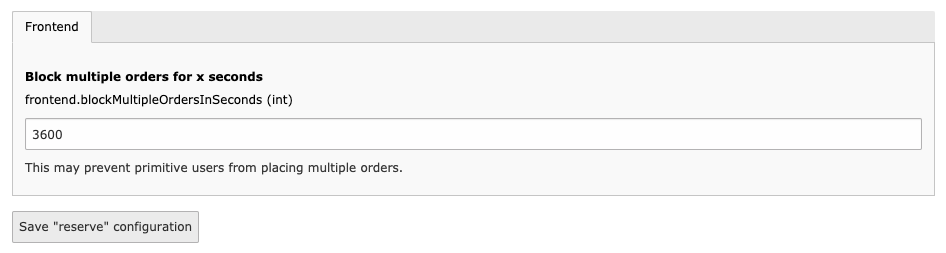

..  include:: /Includes.rst.txt

..  _extconf:

=======================
Extension configuration
=======================

Block multiple orders for a amount of time
==========================================

There is an option that blocks new orders for given amount of time after an
order has been submitted. This is not a guarantee against spam because the user
can bypass the check by deleting the `fe_typo_user` cookie.

