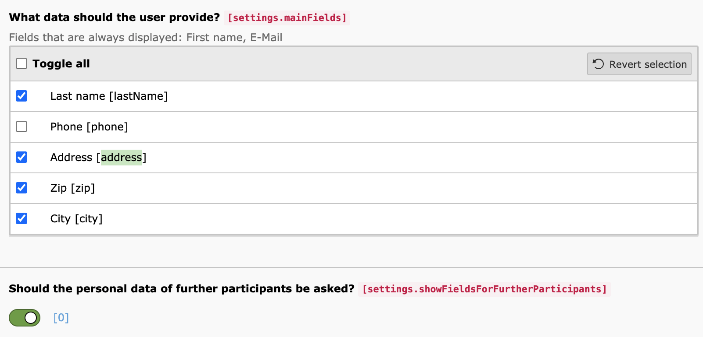

..  include:: /Includes.rst.txt

..  _qrcode:

======================
Frontend configuration
======================

Configuration using Plugin Settings (Flexform)
==============================================

You can decide which fields should be displayed to the user in the frontend.

You can also decide whether additional participants must also enter their
names or whether the number of additional participants is sufficient.
