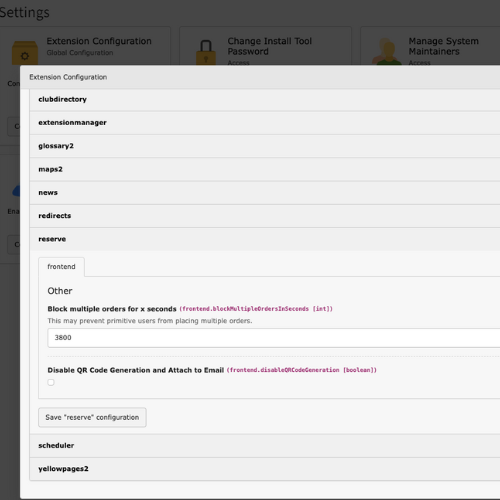

..  include:: /Includes.rst.txt

..  _qrcode:

=====================
QR Code configuration
=====================

Configuration per Facility
==========================

..  figure:: ../../Images/QrCodeSettingsTca.png
    :class: with-shadow
    :alt: TCA
    :width: 500px

You can find all facility based configuration options using the
tab "QR Code settings" when editing a facility in the backend.

..  note::

    The package `endroid/qr-code <https://github.com/endroid/qr-code>`_ will be
    used to generate QR Codes in this extension.

===============
QR Code Disable
===============

You can disable the QR Code as attachment and confirmation page inside extension
settings.

