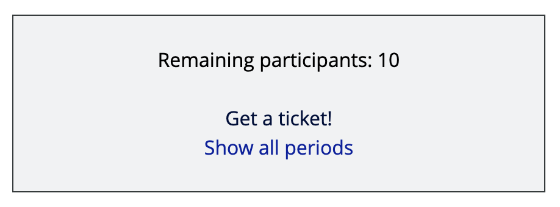
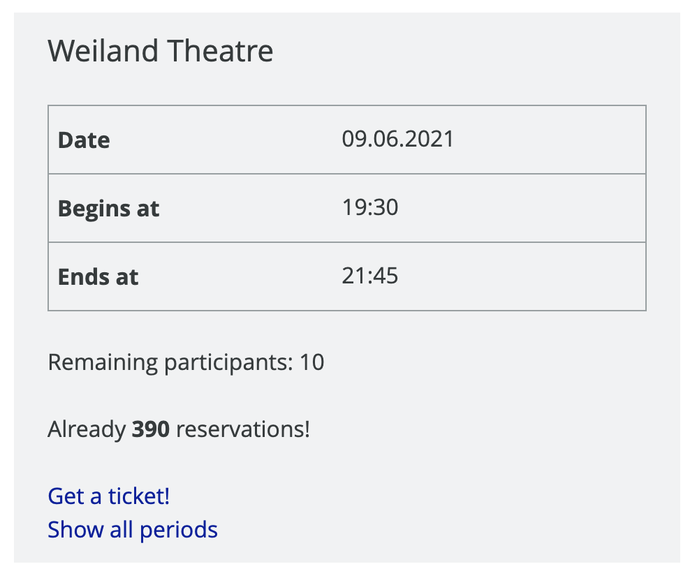

..  include:: /Includes.rst.txt

..  _period-registration-viewhelper:

=================================
ViewHelper for your own extension
=================================

You are using reserve for your ticket registrations and want to combine that with some other extensions like news or events2?
Then try out the PeriodRegistrationViewHelper. This ViewHelper allows you to render remaining participants of one or more periods
and can provide a link to the registration form.

Example usage
-------------

It can look like this:

All you need to do is using the ViewHelper in your own Fluid template. Lets try it out:

..  code-block:: html

    <html xmlns:f="http://typo3.org/ns/TYPO3/CMS/Fluid/ViewHelpers"
          xmlns:jw="http://typo3.org/ns/JWeiland/Reserve/ViewHelpers"
          data-namespace-typo3-fluid="true">
    <jw:periodRegistration facilityUid="3" dateAndBegin="2051548200">
      <f:if condition="{periods}">
        <f:then>
          <f:comment><!--Most time there is just one period!--></f:comment>
          <f:for each="{periods}" as="period">
            
Remaining participants: {period.remainingParticipants}

            <f:if condition="{period.isBookable}">
              <f:link.action pageUid="45" extensionName="reserve" pluginName="Reservation" controller="Checkout" action="form" arguments="{period: period}">Get a ticket!</f:link.action> 
              <f:link.action pageUid="19" extensionName="reserve" pluginName="Reservation" controller="Checkout" action="list">Show all periods</f:link.action>
            </f:if>
          </f:for>
        </f:then>
        <f:else>
          Could not find any period for given time.
        </f:else>
      </f:if>
    </jw:periodRegistration>
    </html>

You can completely customize the output of this ViewHelper. The Variable ``{periods}`` will be added and contains all matching periods (``\JWeiland\Reserve\Domain\Model\Period[]``).
It's an array so either use a foreach or ``{periods.0}`` if you have just one period.

Extended example
================

Can I render some more information? Of course you can! You can use the whole ``\JWeiland\Reserve\Domain\Model\Period`` model with all its relations.
Here is a an extended example that uses some more functionality of the Period model:

..  code-block:: html

    <html xmlns:f="http://typo3.org/ns/TYPO3/CMS/Fluid/ViewHelpers"
          xmlns:jw="http://typo3.org/ns/JWeiland/Reserve/ViewHelpers"
          data-namespace-typo3-fluid="true">
    <jw:periodRegistration facilityUid="3" dateAndBegin="2051548200">
      <f:if condition="{periods}">
        <f:then>
          <f:comment><!--Most time there is just one period!--></f:comment>
          <f:for each="{periods}" as="period">
            <h3>{period.facility.name}</h3>
            <table class="table table-responsive">
              <tr>
                <th>Date</th>
                <td><f:format.date format="d.m.Y">{period.date}</f:format.date></td>
              </tr>
              <tr>
                <th>Begins at</th>
                <td><f:format.date format="H:i">{period.begin}</f:format.date></td>
              </tr>
              <tr>
                <th>Ends at</th>
                <td><f:if condition="{period.end}"><f:then><f:format.date format="H:i">{period.end}</f:format.date></f:then><f:else>Open end</f:else></f:if></li></td>
              </tr>
            </table>
            
Remaining participants: {period.remainingParticipants}

            
Already <strong>{period.countActiveReservations}</strong> reservations!

            <f:if condition="{period.isBookable}">
              <f:link.action pageUid="45" extensionName="reserve" pluginName="Reservation" controller="Checkout" action="form" arguments="{period: period}">Get a ticket!</f:link.action> 
              <f:link.action pageUid="19" extensionName="reserve" pluginName="Reservation" controller="Checkout" action="list">Show all periods</f:link.action>
            </f:if>
          </f:for>
        </f:then>
        <f:else>
          Could not find any period for given time.
        </f:else>
      </f:if>
    </jw:periodRegistration>
    </html>
