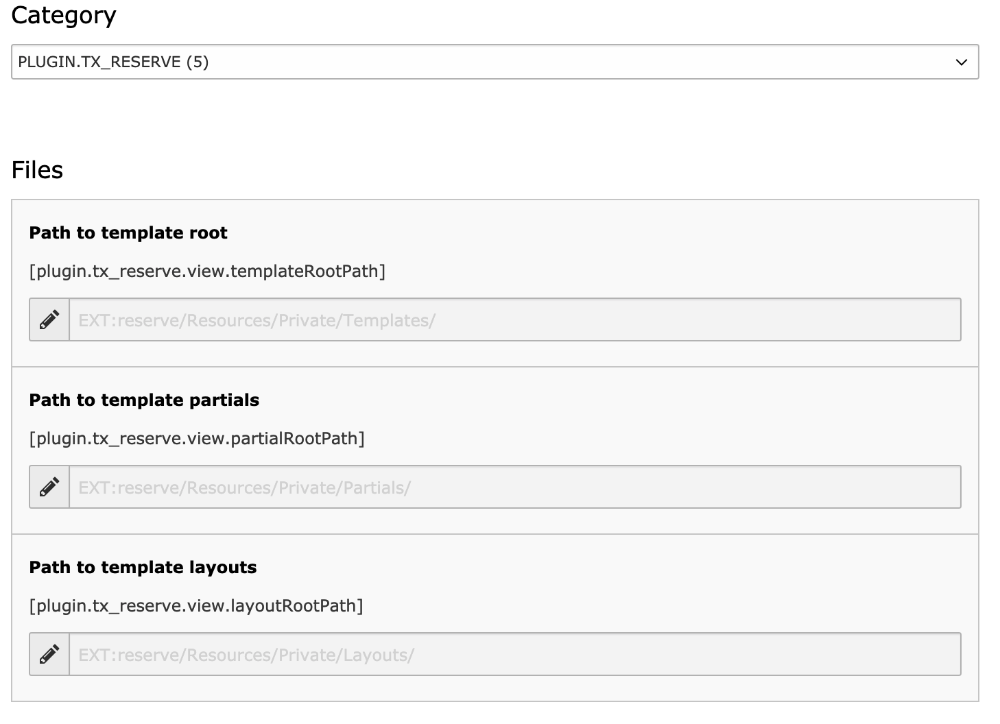

.. include:: ../Includes.txt

.. _update-templates:

================
Update templates
================

This extension uses fluid templates so you are able to override them like in most other TYPO3 extensions.

Override template using TypoScript
----------------------------------

Do you have an site package? Put the templates into your site package extension. Otherwise you can put them into fileadmin if you really want.

.. code-block:: typoscript

		plugin.tx_reserve {
			view {
				templateRootPaths >
				templateRootPaths {
					0 = EXT:reserve/Resources/Private/Templates/
					1 = EXT:site_package/Resources/Private/Extensions/reserve/Templates/
				}
				partialRootPaths >
				partialRootPaths {
					0 = EXT:reserve/Resources/Private/Partials/
					1 = EXT:site_package/Resources/Private/Extensions/reserve/Partials/
				}
				layoutRootPaths >
				layoutRootPaths {
					0 = EXT:reserve/Resources/Private/Layouts/
					1 = EXT:site_package/Resources/Private/Extensions/reserve/Layouts/
				}
			}
		}

Override template using constant editor
---------------------------------------

TYPO3 Backend > Templates > Constant Editor

