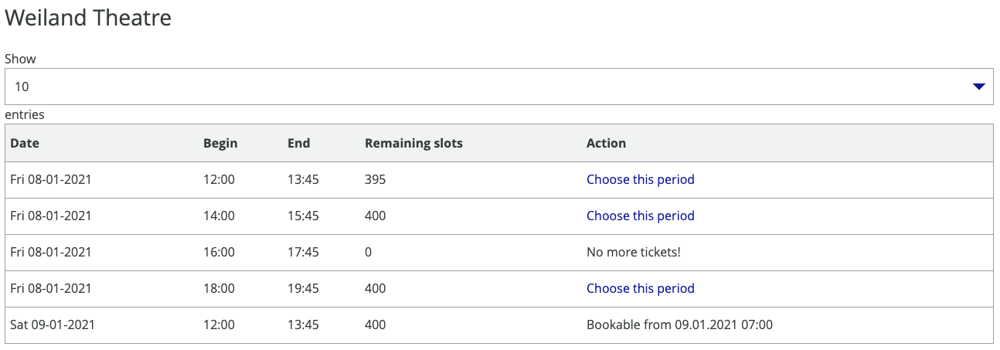
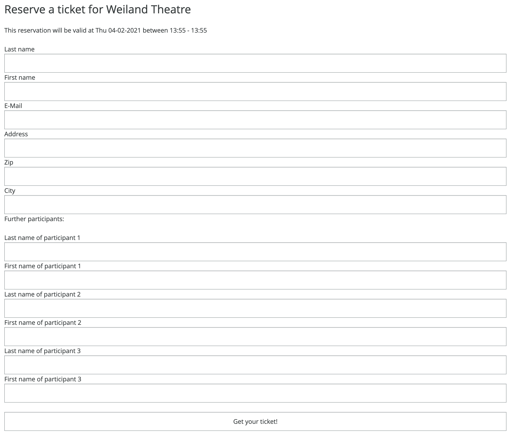
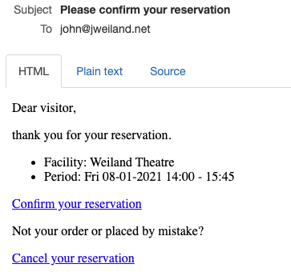
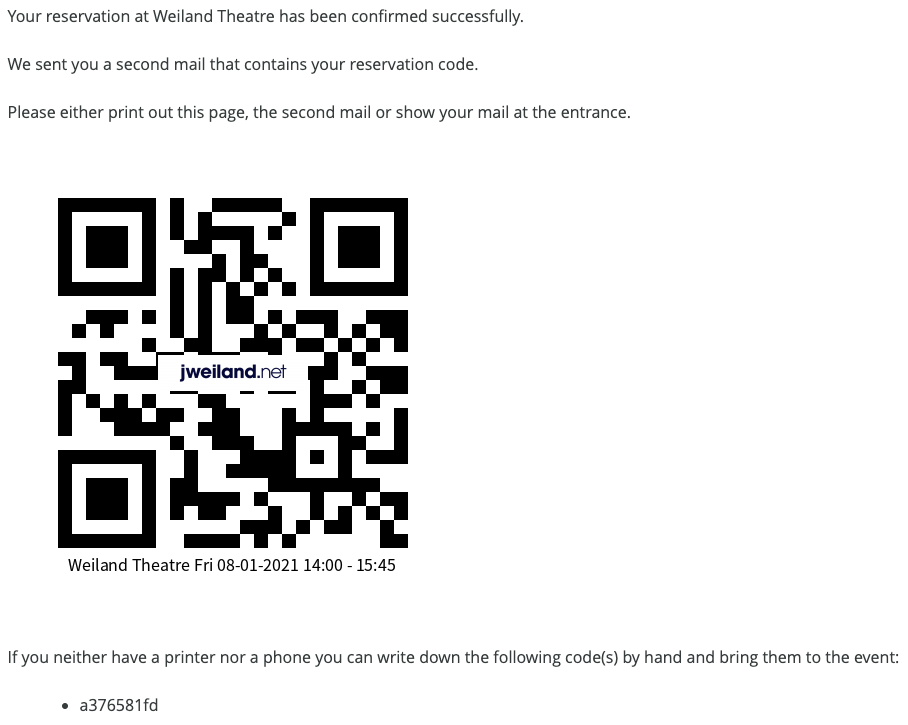

..  include:: /Includes.rst.txt

..  _introduction:

============
Introduction
============

The extension reserve allows you to reserve tickets for one or more persons using a period table and a form.
Each reservation has it's own QR Code that can be scanned at the event.

Frontend screenshots
=====================

Choose a period
---------------

Enter your personal information for your reservation
----------------------------------------------------

Confirm the reservation using the link in the confirmation mail
---------------------------------------------------------------

Print out the QR Code or use your smartphone and show the mail at the events entrance to scan the code
------------------------------------------------------------------------------------------------------

